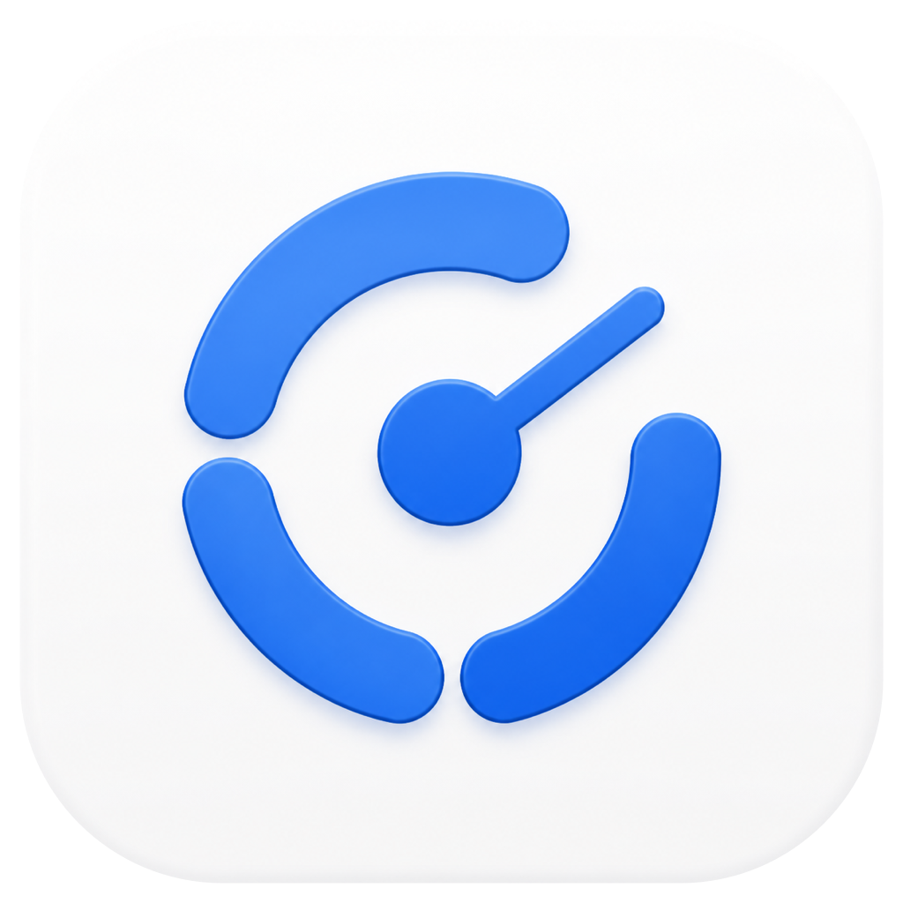
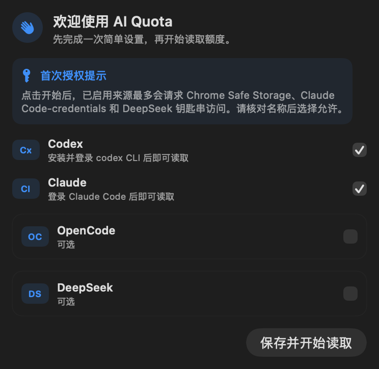

<p align="center">
  
</p>

<h1 align="center">AI Quota</h1>

<p align="center">
  Codex, Claude, OpenCode and DeepSeek quotas, gathered into one quiet macOS menu bar item.
</p>

<p align="center">
  
  
  
  
  
</p>

<p align="center">
  <strong>English</strong> · <a href="README.md">简体中文</a>
</p>

<p align="center">
  <a href="https://github.com/FlyXingByte/ai-quota/releases/tag/v1.3.0-beta.1"><strong>Download the beta</strong></a>
  &nbsp;·&nbsp;
  <a href="#first-run">First run</a>
  &nbsp;·&nbsp;
  <a href="#privacy-boundary">Privacy boundary</a>
</p>

> **Current source · 1.4.0 Bilingual and Resilient**<br>
> The interface follows your system language; a failed read keeps the previous numbers and retries by itself. The prebuilt download is still 1.3.0 Beta 1.

<table>
  <tr>
    <td width="50%" valign="top">
      <h3>Read it at a glance</h3>
      <p>One menu bar slot: `AI` on top, the quota underneath. Every source and reset time stays in the panel.</p>
    </td>
    <td width="50%" valign="top">
      <h3>Usable on first launch</h3>
      <p>A setup screen opens first, explains each permission, and configures OpenCode and DeepSeek.</p>
    </td>
  </tr>
  <tr>
    <td width="50%" valign="top">
      <h3>Local-first</h3>
      <p>The DeepSeek key goes straight into the macOS Keychain. Config, logs and credentials never enter the repository.</p>
    </td>
    <td width="50%" valign="top">
      <h3>Calm dashboard</h3>
      <p>One blue for normal; orange and red appear only when a quota runs low. Adapts to the system appearance.</p>
    </td>
  </tr>
</table>

<p align="center">
  
</p>

<p align="center"><sub>The first run explains the permissions before the user picks any source.</sub></p>

## Language

The interface follows your system language: **English** and **简体中文** ship in the
app, and any other locale falls back to English. Nothing needs to be configured.

## Install

1. Download from the [v1.3.0-beta.1 release](https://github.com/FlyXingByte/ai-quota/releases/tag/v1.3.0-beta.1):
   - `AI-Quota-1.3.0-beta.1-macOS-arm64.dmg` (recommended)
   - or `AI-Quota-1.3.0-beta.1-macOS-arm64.zip`
2. Open the DMG and drag `AI Quota.app` into `Applications`.
3. Launch AI Quota from Applications and follow the first-run setup.

> An Apple Silicon build, macOS 14+. The current prebuilt assets are **not yet notarized by Apple**:
> right-click → Open the first time, or run
> `xattr -d com.apple.quarantine "/Applications/AI Quota.app"`.

## First run

AI Quota **does not touch the Keychain the moment it launches**. It opens the setup
screen first and explains what each source needs; only after you choose “Save and
start reading” does it reach for the enabled sources.

| Source | What it needs | First-time setup |
|---|---|---|
| **Codex** | The `codex` CLI, installed and signed in | Nothing to configure — leave it on |
| **Claude** | Claude Code, installed and signed in | Nothing to configure; allow `Claude Code-credentials` on the first read |
| **OpenCode** | A Chrome session signed in to `opencode.ai` | Paste the whole workspace URL; the app extracts `wrk_…` |
| **DeepSeek** | A working API key | Type it into the setup screen's secure field; it goes straight to the Keychain |

### Keychain prompts you may see

Depending on which sources are on, the first read can ask for at most:

- `Chrome Safe Storage` — OpenCode only;
- `Claude Code-credentials` — Claude only;
- `AI Quota DeepSeek API Key` — DeepSeek only.

Check the name in the prompt before allowing it. Turning a source off means its
credential is never read.

### Where the OpenCode workspace ID lives

Open your OpenCode workspace; the address looks like:

```text
https://opencode.ai/workspace/wrk_xxxxx/go
```

Paste the whole URL into the setup screen — there is no need to cut out the ID.

## Four services, one panel

| Source | What the panel shows | How it is read |
|---|---|---|
| **Codex** | 5-hour, weekly, and per-model buckets | The local `codex app-server`; no token is read |
| **Claude** | 5-hour, weekly, and extra usage | The Claude Code Keychain credential, read-only; the token is never refreshed |
| **OpenCode** | Rolling window, weekly/monthly quota, Zen balance | Reuses the Chrome session for `opencode.ai` |
| **DeepSeek** | CNY / USD balance | The official `/user/balance` API plus an app-specific Keychain item |

Every percentage is **what is left**: a longer bar means more headroom.

## Menu bar modes

Pick one under **“⋯ → Menu bar shows”** in the panel; the change takes effect immediately.

| Mode | Example | Good for |
|---|---|---|
| Codex weekly | `56%` | The default — one number that governs the week |
| Claude weekly | `87%` | Claude Code as the main tool |
| OpenCode weekly | `48%` | OpenCode Go as the main tool |
| DeepSeek balance | `¥45` | Watching API credit only |
| Whichever has least left | switches by itself | Only the tightest quota matters |

The status item is always the two-line single-metric widget — `AI` on top, the
number underneath. The old side-by-side mode, which occupied several menu bar
slots, is gone.

Only sources that are actually enabled appear in this menu, and turning off the
source the menu bar is pinned to moves it to one that still reports.

## Changing settings later

Use **“⋯ → Source settings…”** to re-pick sources, update the OpenCode URL, or
replace the DeepSeek key.

The advanced config file lives at:

```text
~/Library/Application Support/AIQuota/config.json
```

It is saved with `0600` permissions. The DeepSeek key is never written to it.

## When a read fails

A failed refresh keeps the previous numbers rather than blanking the card: the
error appears next to them, the row is marked as the last successful reading, and
the menu bar dims that number instead of dropping to `!`. Retries follow at 60 s
and 180 s, and a refresh also happens on wake and when the network comes back.

## Privacy boundary

<table>
  <tr>
    <td width="50%" valign="top">
      <h3>Stays on this Mac</h3>
      <p>Config, refresh logs, the temporary copy of the cookie database, and Keychain credentials.</p>
    </td>
    <td width="50%" valign="top">
      <h3>Never enters Git</h3>
      <p>API keys, OAuth tokens, cookies, workspace configuration, real email addresses, and signing keys.</p>
    </td>
  </tr>
</table>

- Codex only calls the local CLI's read-only rate-limit endpoint.
- The Claude token is used for the quota query alone — never refreshed, never written back.
- OpenCode requests go through an ephemeral URLSession with automatic redirects disabled.
- The DeepSeek key uses an app-specific Keychain item, not a shell environment variable.
- `config.json`, `.env`, certificates and private keys are all excluded by `.gitignore`.
- The icon sources have had optional C2PA/JUMBF generation metadata stripped; the pixels are unchanged.

## Build from source

```bash
gh repo clone FlyXingByte/ai-quota
cd ai-quota
./make-signing-cert.sh   # once: a local signing identity
./install.sh
```

Building needs an Apple Silicon Mac, macOS 14+, and the Command Line Tools.

`make-signing-cert.sh` creates a self-signed certificate in your login keychain.
It matters more than it looks: macOS keys a TCC or Keychain grant to the app's
designated requirement, and an ad-hoc signature has no identity, so the
requirement degrades to a cdhash that changes on every rebuild — silently
revoking every permission you had already granted. With the certificate the
requirement becomes `identifier "com.flyx.aiquota" and certificate root = H"…"`,
which survives rebuilds. The certificate is **not** installed as a trusted root;
`codesign` does not need that. Without it the build falls back to ad-hoc and says so.

## Building release assets

A local build, for your own machine only:

```bash
./scripts/create-release.sh 1.4.0
./scripts/verify-release.sh 1.4.0
```

For anyone else, the build has to be Developer ID signed and notarized by Apple —
otherwise Gatekeeper stops it on every other Mac:

```bash
./scripts/notarize-release.sh 1.4.0
```

That re-signs with the Developer ID certificate (hardened runtime and secure
timestamp — Apple rejects a submission missing either), submits for
notarization and waits, staples the ticket onto both the app and the disk image,
and verifies the result the way Gatekeeper will. Stapled assets pass **offline**.

Two things have to exist first; the script checks for both and prints the exact
steps when they don't:

1. **A Developer ID Application certificate** — requires Apple Developer Program
   membership ($99/year). Create it in Xcode → Settings → Accounts → Manage
   Certificates and import it into your login keychain.
2. **Notary credentials**, stored in the keychain with an app-specific password:

   ```bash
   xcrun notarytool store-credentials "AI Quota Notary" \
     --apple-id <your Apple ID> --team-id <TEAMID> --password <app-specific password>
   ```

Neither lives in this repository, and neither should.

<details>
<summary><strong>Diagnostic commands</strong></summary>

```bash
"/Applications/AI Quota.app/Contents/MacOS/AIQuota" --probe
"/Applications/AI Quota.app/Contents/MacOS/AIQuota" --identity
"/Applications/AI Quota.app/Contents/MacOS/AIQuota" --config
"/Applications/AI Quota.app/Contents/MacOS/AIQuota" --self-test
"/Applications/AI Quota.app/Contents/MacOS/AIQuota" --snapshot-setup
```

</details>

<details>
<summary><strong>Adding or changing interface text</strong></summary>

Every user-facing string goes through `L("some.key")` and is defined in both
`Resources/en.lproj/Localizable.strings` and `Resources/zh-Hans.lproj/Localizable.strings`.
`scripts/check-localization.sh` — which `build.sh` and CI both run — fails the
build if a key is missing from a table, or if a table carries a key nothing uses.

Diagnostic output (`--probe`, `--dump`, `last-refresh.log`, `last-launch.log`) is
deliberately English-only: it is what gets pasted into an issue.

</details>

<details>
<summary><strong>Implementation note: Chrome cookies</strong></summary>

OpenCode has no public quota API, so AI Quota copies Chrome's cookie SQLite
database, queries only the rows matching `opencode.ai`, requests the page in a
temporary session, and parses the SSR hydration payload. The copy is deleted as
soon as the read finishes.

See [`Sources/ChromeCookies.swift`](Sources/ChromeCookies.swift) and
[`Sources/OpenCodeProvider.swift`](Sources/OpenCodeProvider.swift).

</details>
